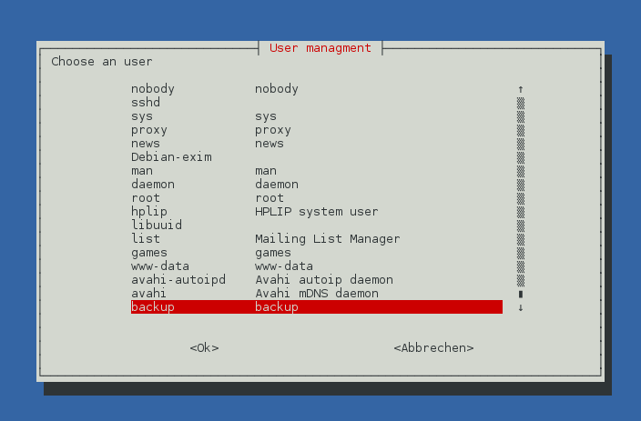

debian-umgmt
=================================================

A little tool to manage user accounts on Debian

NOTE : does not work yet

Requirements :

- Python 2.7
- whiptail
- adduser package
- shadow tools
(All preinstalled on Debian by default.)

Additionally required :

- [whiptail.py 0.3.dev](https://github.com/marwano/whiptail)
- sudo
- pexpect (python-pexpect)

Copyright (c) 2014 -2015 Dennis Thekumthala. See the file "LICENSE" for details on Licensing.

